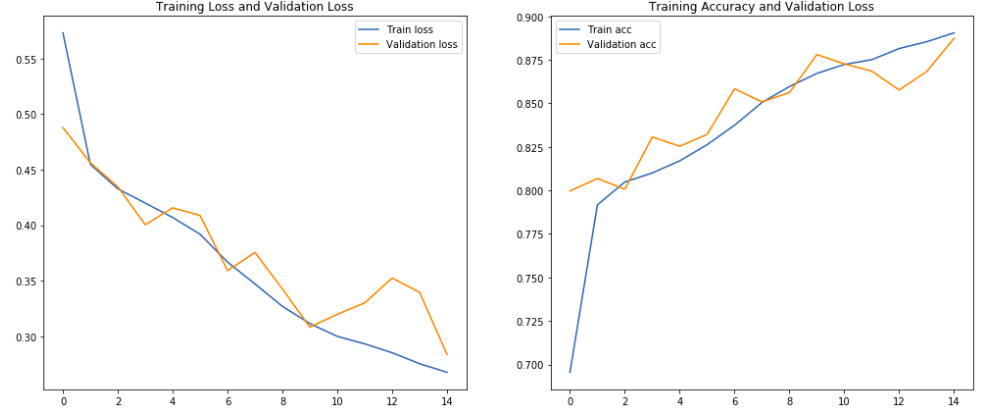

# Histopathlogic-Cancer-Detection
In this project the aim was to create an algorithm to identify metastatic cancer in small image patches taken from larger digital pathology scans. Keras was used in building this model. An accuracy of 88.8% was acheived using this model. 

